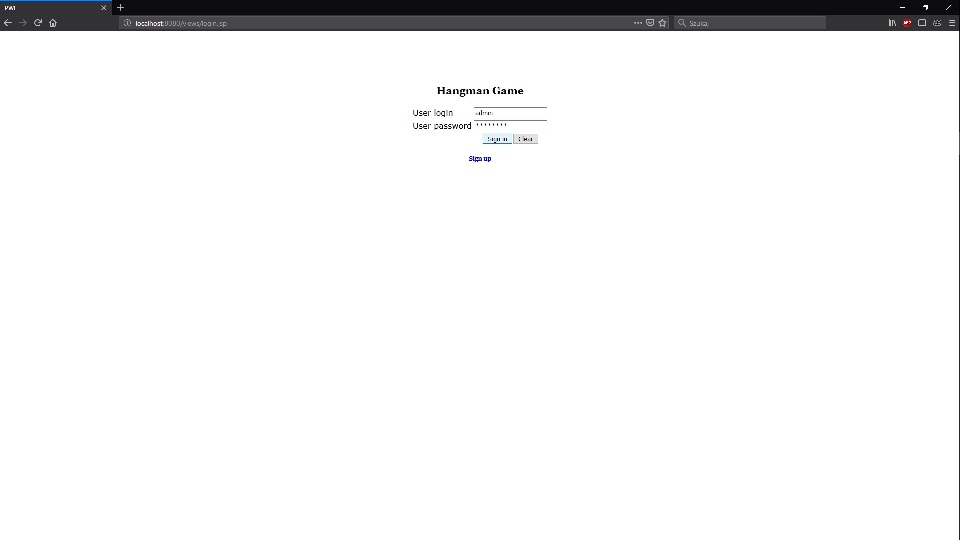

##HANGMAN APP

###Description
The simple hangman game web application. the user can choose game language. An app draws sentence and user can guess it by suggesting letters. A game counts points that may be show in the table. All is available in two color versions and after register or log in to app.

Used technologies and tools:
- Java EE with Maven,
- SQLite,
- HTML,
- CSS,
- JavaScript,
- Photoshop,

Project created in the Intellij IDEA Ultimate environment.
